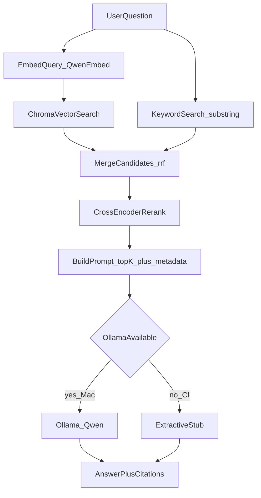
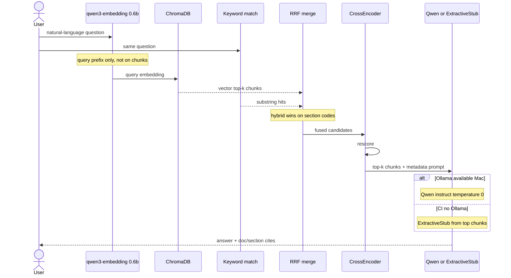
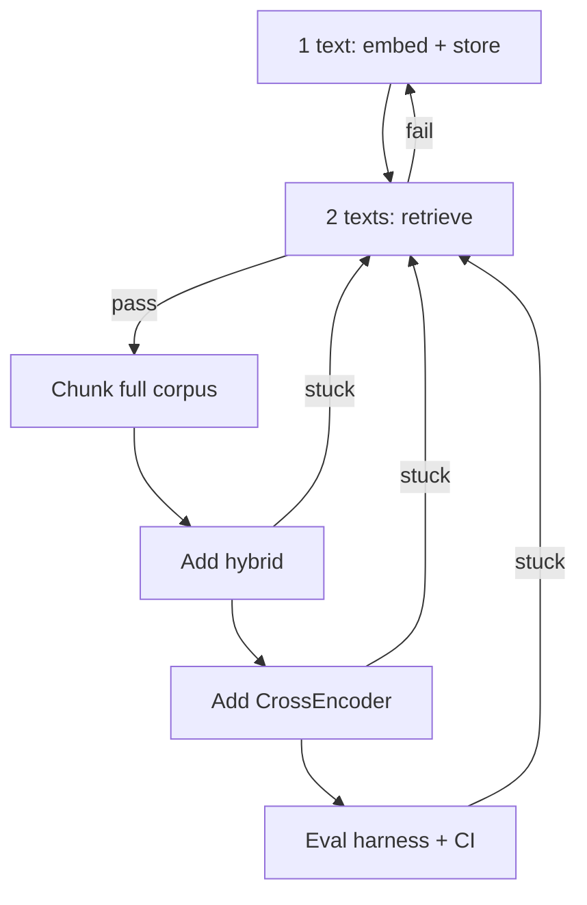
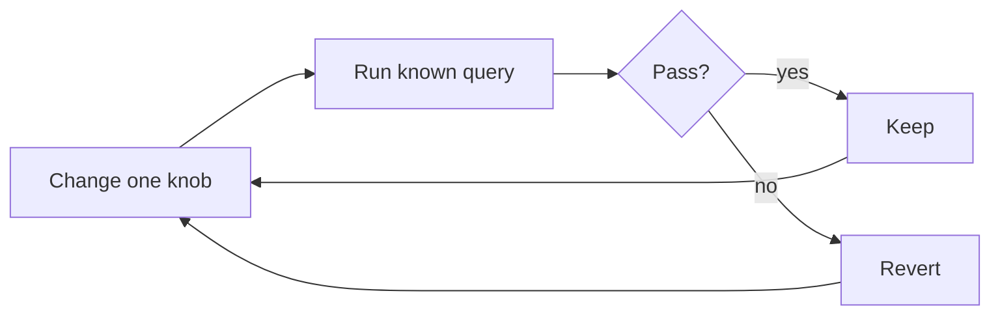
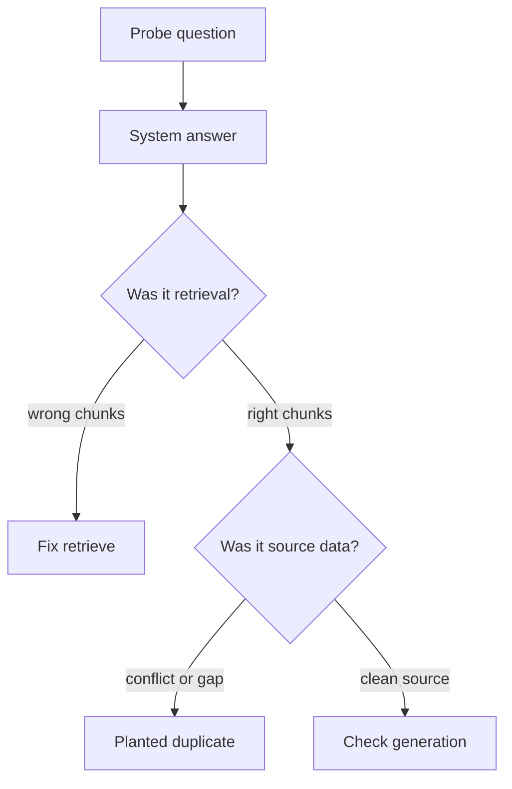

# Policy RAG visual board

Whiteboard type: **vertical swimlane pipeline architecture** (stage-based RAG system map).

Open this file in Markdown preview to render the charts.

Local stack is Qwen-only. Dual-core generation: Ollama Qwen on Mac, extractive stub in CI. Do not embed with the chat model. Do not use Mistral. MiniLM is only the CrossEncoder.

---

## Locked model stack

| Role | Model | Runtime |
| --- | --- | --- |
| Embeddings | `qwen3-embedding:0.6b` | Ollama |
| Vector store | ChromaDB | local |
| Hybrid merge | Reciprocal Rank Fusion (RRF) | in-process |
| Rerank | `cross-encoder/ms-marco-MiniLM-L-6-v2` | sentence-transformers CrossEncoder |
| Generation · Mac | local Qwen instruct | Ollama, temperature 0 |
| Generation · CI | ExtractiveStub | no LLM; top chunks + citations |

Index chunks as raw text. Prefix **queries only**:

```text
Instruct: Given a company policy question, retrieve the relevant policy passage
Query: {question}
```

---

## 1. Four-stage swimlane

```mermaid
flowchart LR
    subgraph dataCol ["1 · Data"]
        direction TB
        d1[3-4 policy docs]
        d2[500-800 words]
        d3[Remote / expense / PTO]
        d4[Plant outdated duplicate]
        d5[Chunk 400-500 + overlap]
        d6[Meta: name, section, version]
        d1 --> d2 --> d3 --> d4 --> d5 --> d6
    end

    subgraph retrCol ["2 · Retrieval"]
        direction TB
        r1[Prove 2-text loop]
        r2[qwen3-embedding 0.6b]
        r3[ChromaDB store]
        r4[Vector top-k]
        r5[Keyword substring]
        r6[RRF merge]
        r7[CrossEncoder MiniLM]
        r1 --> r2 --> r3 --> r4 --> r5 --> r6 --> r7
    end

    subgraph genCol ["3 · Generation"]
        direction TB
        g1[Build prompt + metadata]
        g2{Ollama available?}
        g3[Qwen instruct · temp 0]
        g4[Extractive stub]
        g5[Answer + cite sources]
        g1 --> g2
        g2 -->|Mac| g3 --> g5
        g2 -->|CI| g4 --> g5
    end

    subgraph evalCol ["4 · Evals"]
        direction TB
        e1[8+ gold questions]
        e2[Retrieval recall]
        e3[Answer key facts]
        e4[Data-quality probe]
        e5[pytest + CI]
        e1 --> e2 --> e3 --> e4 --> e5
    end

    d6 --> r1
    r7 --> g1
    g5 --> e1
    e4 -.->|debug| d4
    e5 -.->|stuck| r1
```



---

## 2. Main runtime flow

This is the live query path. Vector and keyword run in parallel, merge with RRF, then rerank. Generation branches on whether Ollama is up.



`EmbedQuery_QwenEmbed` is `qwen3-embedding:0.6b` with the query prefix. `Ollama_Qwen` is the instruct chat tag at temperature 0. MiniLM is only the CrossEncoder, not the embedder.



---

## 3. Incremental build loop



Prove A→B with Ollama `qwen3-embedding:0.6b` and Chroma before scaling.

---

## 4. Experiment loop

Change **one** knob only. Keep the Qwen embed and Qwen chat tags locked.



| Knob | Compare |
| --- | --- |
| chunk size | 400 vs 500 chars |
| top-k | default vs wider candidate set |
| retrieval | vector-only vs hybrid |
| rerank | CrossEncoder on vs off |
| generation | Qwen vs ExtractiveStub |

---

## 5. Two-question debug loop

Planted issue: **outdated duplicate** with conflicting details.



Diagnosis target: source data is wrong; retrieval and generation did their job.

---

## Stage stack

| Stage | Work | Stack |
| --- | --- | --- |
| Data | 3-4 policies, plant outdated duplicate, chunk, attach metadata | Remote / expense / PTO |
| Retrieval | 2-text loop, then scale; vector + keyword in parallel; RRF merge; CrossEncoder | Ollama `qwen3-embedding:0.6b`, ChromaDB, `cross-encoder/ms-marco-MiniLM-L-6-v2` |
| Generation | Prompt from top-k + metadata; Qwen on Mac, extractive stub in CI | Ollama Qwen instruct temp 0 · ExtractiveStub |
| Evals | 8+ gold items, recall + key facts, data-quality probe | pytest, CI |
