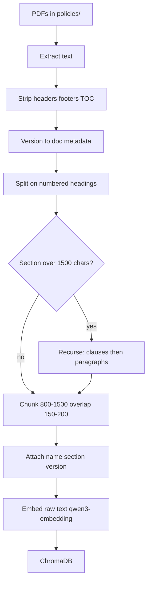
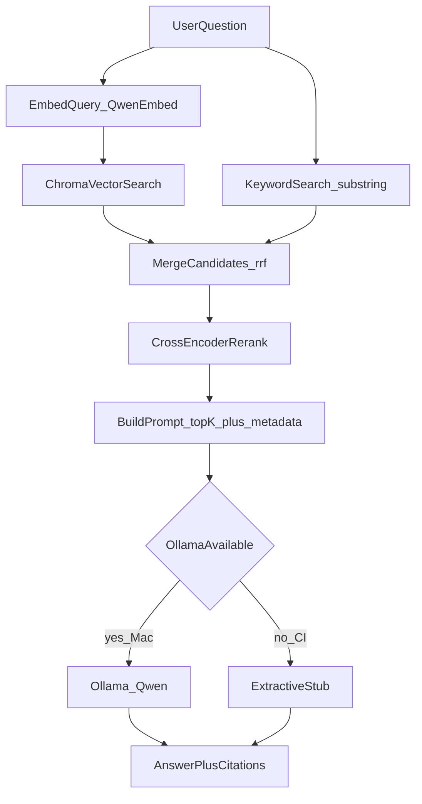
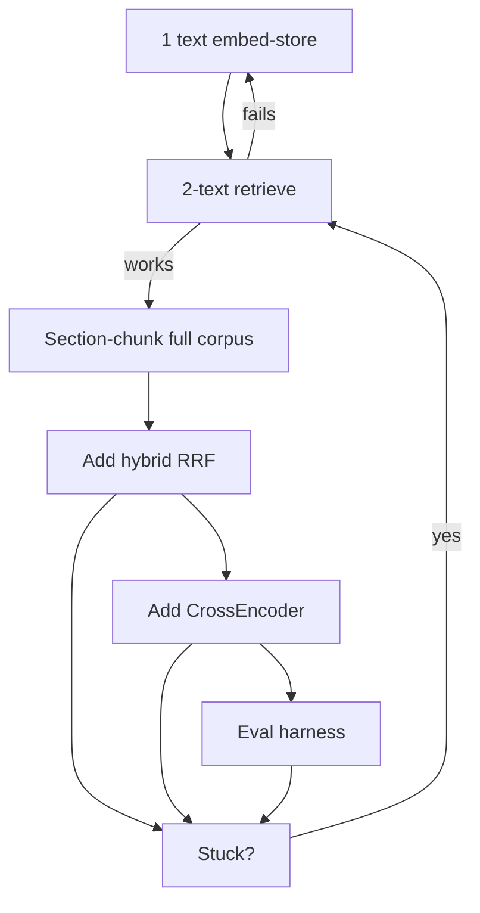
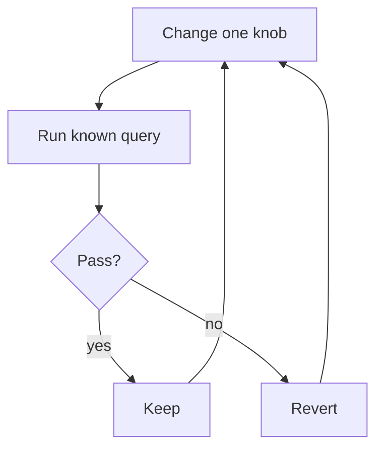
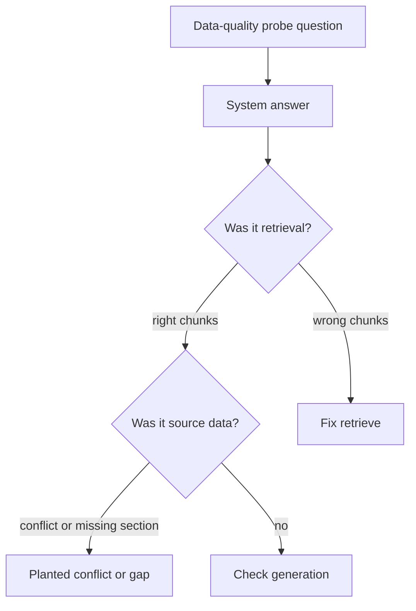

# Policy RAG execution graph

Vertical swimlane pipeline: **Data → Retrieval → Generation → Evals**, plus build / experiment / debug loops.

Corpus is the Coforge PDFs in `policies/`. Chunking is **section-aware recursive split**. Local stack is Qwen-only. Dual-core generation: Ollama Qwen on Mac, extractive stub in CI. MiniLM is only the CrossEncoder.

## Locked model stack

| Role | Model | Runtime |
| --- | --- | --- |
| Embeddings | `qwen3-embedding:0.6b` | Ollama |
| Vector store | ChromaDB | local |
| Hybrid merge | Reciprocal Rank Fusion (RRF) | in-process |
| Rerank | `cross-encoder/ms-marco-MiniLM-L-6-v2` | sentence-transformers CrossEncoder |
| Generation · Mac | local Qwen instruct | Ollama, temperature 0 |
| Generation · CI | ExtractiveStub | no LLM; top chunks + citations |

Index chunks as raw text. Prefix **queries only**:

```text
Instruct: Given a company policy question, retrieve the relevant policy passage
Query: {question}
```

## Data ingest and chunking flow

These PDFs are numbered legal policies (`1.0 Context`, `8.0 Reporting a Concern`). The citation unit is **document + section**, so the chunk boundary is the section heading. Recurse only when a section is too long. Do not split on page breaks: sections already wrap across pages.



**Split on:** `1.0`, `2.1`, `8.0 Reporting a Concern`.  
**Then, if needed:** `(a)` / `(b)` definitions, blank lines, sentences.  
**Skip:** table of contents, running headers, page numbers.  
**Keep:** version history as document metadata, not mixed into body chunks.

| Knob | Value | Why |
| --- | --- | --- |
| Primary split | numbered section (`N.0` / `N.N`) | hybrid and cites use section codes |
| Target size | 800–1500 characters | one clause, not half a definition |
| Overlap | 150–200 characters | clauses that span subsections |
| Rejected | page chunks, 400–500 char windows | page breaks cut sections; 400 chars cuts definitions |

Plant one **outdated duplicate** of a policy with conflicting details. That plant is the data-quality probe, not a retrieval bug.

## Main runtime flow

Vector and keyword run in parallel, merge with RRF, then rerank. Generation branches on whether Ollama is up.



`EmbedQuery_QwenEmbed` is `qwen3-embedding:0.6b` with the query prefix. `Ollama_Qwen` is the instruct chat tag at temperature 0.

## End-to-end query path

```mermaid
flowchart LR
    subgraph dataCol [Data]
        docs[Coforge policy PDFs]
        plant[Outdated duplicate]
        chunk[Section-aware recursive chunk]
        meta[Name section version]
        docs --> plant
        docs --> chunk
        chunk --> meta
    end

    subgraph retrCol [Retrieval]
        embed[qwen3-embedding 0.6b]
        store[ChromaDB]
        vector[Vector top-k]
        keyword[Keyword substring]
        hybrid[RRF merge]
        rerank[CrossEncoder MiniLM]
        embed --> store
        store --> vector
        store --> keyword
        vector --> hybrid
        keyword --> hybrid
        hybrid --> rerank
    end

    subgraph genCol [Generation]
        prompt[Prompt plus metadata]
        ollama{Ollama up?}
        llm[Qwen instruct temp 0]
        stub[Extractive stub]
        cite[Answer plus citations]
        prompt --> ollama
        ollama -->|Mac| llm --> cite
        ollama -->|CI| stub --> cite
    end

    subgraph evalCol [Evals]
        gold[8-plus gold questions]
        recall[Retrieval recall]
        acc[Answer key facts]
        ci[pytest then CI]
        gold --> recall
        gold --> acc
        recall --> ci
        acc --> ci
    end

    meta --> embed
    rerank --> prompt
    cite --> gold
```



## Incremental build loop

Prove each layer before adding the next. If anything breaks, fall back to the two-text retrieve loop.



Prove the 2-text loop with `qwen3-embedding:0.6b` → Chroma **before** writing the PDF chunker.

## Experiment loop

Change one knob, run a known query, then keep or revert. Models stay locked; do not swap Qwen chat in as an embedder.



Knobs: section max size 800 vs 1500, overlap 150 vs 200, top-k, hybrid vs vector, rerank on/off, extractive stub vs Qwen.

## Two-question debug loop

Use this on the planted outdated duplicate. Confirm the failure is source data, not retrieval or generation.



## Stage checklist

| Stage | What runs | Stack |
| --- | --- | --- |
| Data | Coforge PDFs in `policies/`, plant one outdated duplicate, section-aware recursive chunk, attach metadata | Whistleblower, RPT, Dividend, Materiality |
| Retrieval | Minimal 2-text loop, then scale; vector + keyword in parallel; RRF merge; CrossEncoder rerank | Ollama `qwen3-embedding:0.6b`, ChromaDB, `cross-encoder/ms-marco-MiniLM-L-6-v2` |
| Generation | Build prompt from top-k + metadata; Qwen on Mac, extractive stub in CI | Ollama Qwen instruct temp 0 · ExtractiveStub |
| Evals | 8+ gold questions, recall + key-fact accuracy, data-quality probe | pytest, CI |
