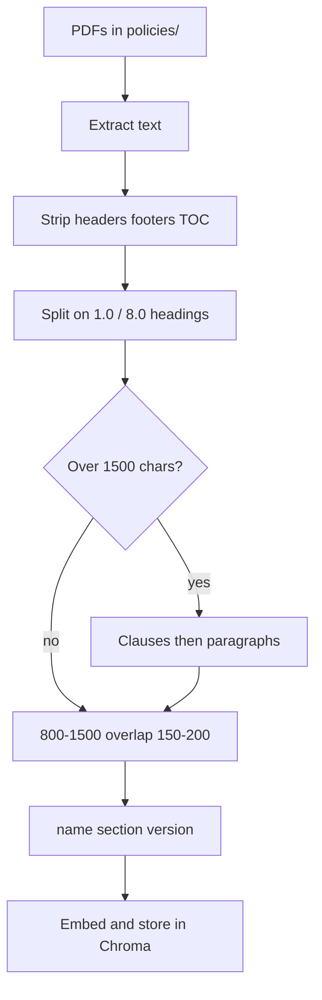
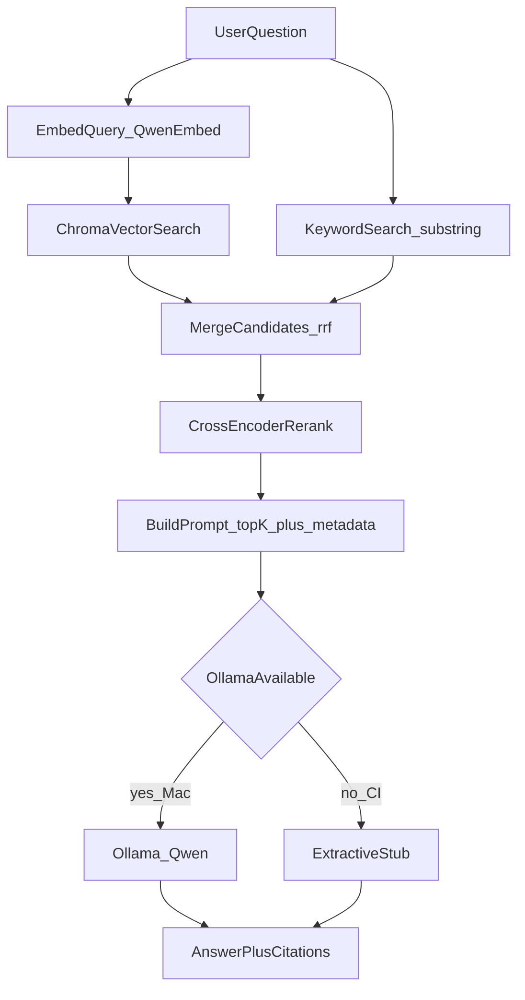
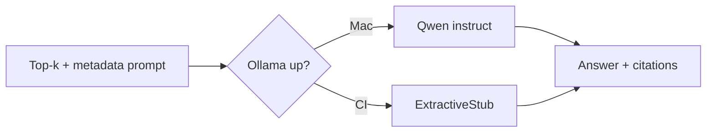
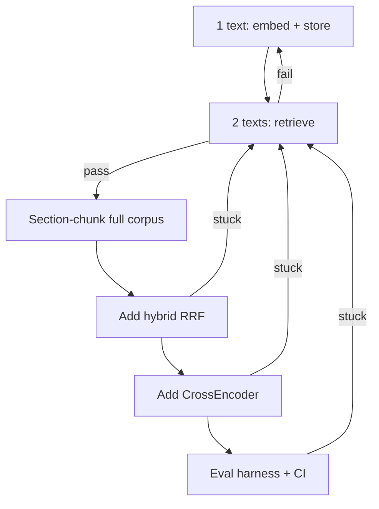
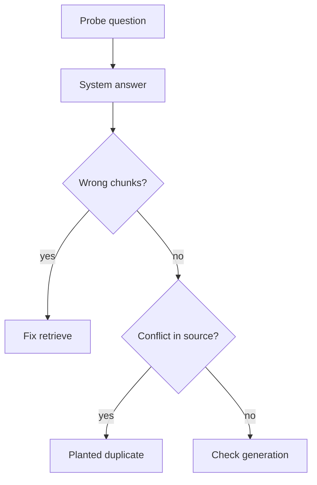

# Policy RAG from scratch

Internal Q&A over Coforge policy PDFs

**Dual-core:** Qwen on Mac · extractive stub in CI  
**Chunking:** section-aware recursive split

Open in Markdown preview or Marp. Charts render as Mermaid.

---

# The job

A working RAG pipeline from scratch, over real numbered policies.

- Ingest PDFs in `policies/`
- Chunk on section headings, then recurse if long
- Embed, hybrid-retrieve, rerank, generate, evaluate
- Plant one data-quality bug and prove it is **source data**, not retrieval
- Cite **document name + section** on every answer

---

# Corpus

| File | Role in the pipeline |
| --- | --- |
| `Whistleblower-Policy-1.pdf` | Numbered `1.0`–`14.0` sections |
| `RPT-Policy-1.pdf` | Related-party transactions |
| `dividend-distribution-policy-new.pdf` | Short `1.0` / `2.0` / `3.0` / `4.0` |
| `Policy on Materiality of Events.pdf` | Materiality / disclosure events |

Plus one **planted outdated duplicate** with conflicting details.

Not the lab’s synthetic remote / expense / PTO set. Not 400–500 character windows.

---

# Four stages


| Stage | Output |
| --- | --- |
| Data | Section chunks with name / section / version |
| Retrieval | Hybrid top chunks |
| Generation | Answer + citations |
| Evals | Recall, key facts, pytest + CI |

---

# Locked stack

Qwen-only. Do not embed with the chat model. Do not use Mistral.

| Role | Model | Where |
| --- | --- | --- |
| Embed | `qwen3-embedding:0.6b` | Ollama |
| Store | ChromaDB | local |
| Hybrid | Reciprocal Rank Fusion | in-process |
| Rerank | `cross-encoder/ms-marco-MiniLM-L-6-v2` | CrossEncoder |
| Generate · Mac | Qwen instruct, temp `0` | Ollama |
| Generate · CI | ExtractiveStub | no LLM |

MiniLM is **only** the reranker.

---

# Chunking flow

Split on numbered headings. Recurse only when a section is still too long.



---

# Why this chunker

These policies already have the citation unit.

- `2.0 Objective` stays **one chunk**
- `5.0 Definitions` splits on `(a)` / `(i)`, still labeled `5.0 Definitions`
- Hybrid can hit `8.0` the same way it would hit `PTO-4.2`
- Answers cite **Whistleblower · 8.0 Reporting a Concern**

Rejected: page chunks (sections wrap pages) and 400–500 char windows (they cut definitions in half).

---

# Main runtime flow

Vector and keyword run in **parallel**. Merge is RRF. Generation branches on Ollama.



---

# Dual-core generation

Same retrieval on every machine. Only the writer changes.



- **Mac:** full RAG answers from local Qwen
- **CI:** stub extracts from retrieved chunks so pytest runs without a chat model

---

# Query prefix

Index chunks as **raw text**. Prefix **questions only**.

```text
Instruct: Given a company policy question, retrieve the relevant policy passage
Query: {question}
```

Same prefix on every query. Changing it later is a re-index, not a small knob.

---

# Incremental build

Prove each layer before adding the next.



First code: `qwen3-embedding:0.6b` → Chroma on two known strings. Then the PDF chunker.

---

# Experiment knobs

Change **one** knob. Run a known query. Keep or revert.

| Knob | Compare |
| --- | --- |
| section max size | 800 vs 1500 chars |
| overlap | 150 vs 200 chars |
| top-k | default vs wider set |
| retrieval | vector-only vs hybrid |
| rerank | CrossEncoder on vs off |
| generation | Qwen vs ExtractiveStub |

Do not swap the embedder and the chat model in the same run.

---

# Debug the planted duplicate

Ask a probe that should surface the conflict.



**Target diagnosis:** retrieval and generation did their job. The source data is wrong.

---

# What “done” looks like

1. Two-text retrieve loop prints the right hit
2. PDFs section-chunked with name / section / version
3. Hybrid query beats vector-only on a section code (`8.0`, `5.0`)
4. CrossEncoder reranks the fused list
5. Mac: Qwen answer + citations · CI: extractive stub
6. 8+ gold tests: recall + key facts
7. Probe traces the bug to the outdated duplicate

---

# Next step

Build loop step 1–2 only:

1. Embed one short text with `qwen3-embedding:0.6b`
2. Store it in Chroma
3. Add a second, different text
4. Query and confirm the relevant one ranks first

Then section-chunk the PDFs. Not before.
